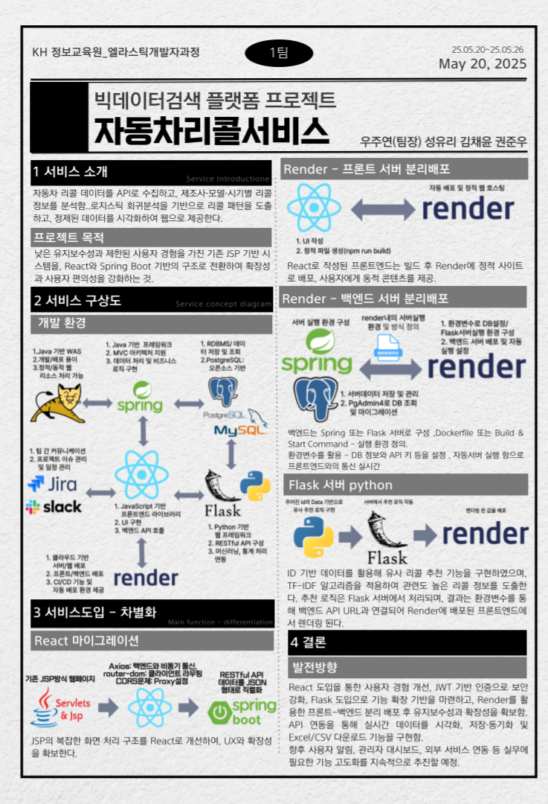

## 👨‍💻 권준우 | Backend Developer (GitHub: kjo5191)

### ✨ About Me

백엔드 개발자로 커리어 전환을 준비 중인 권준우입니다.  
Spring 기반의 웹 프로젝트를 직접 설계하고 구현하면서  
**서비스 흐름 이해, 구조 설계, 문제 해결 능력**을 키워왔습니다.

단순히 기능 구현에 그치지 않고,  
"**왜 이렇게 구성하는가**", "**어떻게 더 나아질 수 있는가**"를 고민하며 성장 중입니다.  

---
  

## 💻 주요 프로젝트 요약

### 🛒 ShoFriend - 쇼핑몰 웹 플랫폼 (팀 프로젝트)

📌 🔽 프로젝트 요약 포스터 보기

**기간**  

1차 : 2025.04.08 ~ 2025.04.15  
2차 : 2025.05.08 ~ 2025.05.14  

**기술 스택**  

Spring Framework (Legacy) → Spring Boot (2차 마이그레이션), JSP, JSTL, MyBatis, MySQL, WebSocket

**프로젝트 소개**  

4인 팀으로 진행한 쇼핑몰 웹 플랫폼 구현 프로젝트입니다.  
단순한 상품 거래가 아닌, "**친구와 함께 쇼핑하는 경험**"을 제공하는 것을 차별화 포인트로 설정했습니다.

이를 위해  
- **1:1 채팅**, **상품 링크 공유**, **친구의 구매 상품 노출 기능**을 구현하고  
- **구매자/판매자 회원가입**, **상품 등록/조회/구매**, **마이페이지**, **리뷰 시스템** 등  
이커머스의 핵심 흐름을 모두 구현했습니다.

또한 1차 프로젝트는 Spring Legacy 기반으로 시작했으며,  
2차 프로젝트에서는 Spring Boot로 마이그레이션하여 유지보수성과 확장성을 개선했습니다.  

**담당 역할 요약**  

| 기능 영역 | 세부 내용 |
|-----------|-----------|
| DB 설계 | 전반적인 ERD 설계 및 테이블 구조 정의 |
| 마이페이지 | 구매자/판매자 유형별 마이페이지 구현 (회원정보 수정, 구매내역, 점포 관리 등) |
| 상품 구매 | 장바구니 없이 바로 구매하는 방식 구현, 주문 데이터 저장 처리 |
| 상품 카테고리 | 카테고리별 필터링, 페이징 처리, 정렬(최신순/낮은가격순), 키워드 검색 |
| 채팅 | WebSocket을 활용한 1:1 친구 간 실시간 채팅 기능 및 상품 링크 공유 기능 |

**기술적 포인트**  

- Spring Legacy 프로젝트를 Spring Boot 기반으로 리팩토링 (환경 설정, 구조 재정비)
- WebSocket을 활용한 실시간 채팅 + 상품 공유 기능 구현
- 카카오페이 결제 API 연동 (팀원 구현, 구조 및 흐름 이해)

🔗 [레포지토리 바로가기](https://github.com/kjo5191/Project_ShoFriend)

---

### 🧠 StudyLog - 취업 학습 도우미 웹 플랫폼 (개인 프로젝트)

**기간**: 2025.04.22 ~ 2025.06.13  

**기술 스택**  
Spring Boot, Thymeleaf, JPA(Hibernate), MySQL, Bootstrap5, Apache Solr, Python(Flask), OpenAI API  
  
**프로젝트 소개**  
  
개발자 취업을 준비하며 학습한 면접 질문과 답변을 정리하고,  
AI 피드백 및 검색 기능까지 지원하는 **개발자 전용 학습/기록 플랫폼**입니다.  

단순한 질문/답변 정리에 그치지 않고  
- **AI 피드백 요청**,  
- **답변 자동 저장**,  
- **랜덤 질문/답변 생성**,  
- **FullCalendar 기반 일정 관리**,  
- **Apache Solr 기반 검색 기능**  
  
등의 다양한 기능을 통해 **자기 주도적 학습**을 돕는 도구로 발전시키고자 했습니다.  
  

**기능 요약**  

| 기능 영역 | 세부 내용 |
|-----------|-----------|
| 질문 관리 | CRUD 기능 구현 (목록, 작성, 수정, 삭제), 카테고리 분류 |
| 랜덤 질문 | 랜덤 질문 출력 및 답변 작성/수정 기능 |
| 답변 저장 | 비동기 AJAX 방식으로 사용자 답변 저장 및 피드백 연동 |
| AI 피드백 | Flask + OpenAI API 연동, 실시간 피드백 제공 및 UI 표시 |
| 일정 관리 | FullCalendar 도입, 면접/지원 일정 등록 및 필터링 기능 |
| 검색 기능 | Apache Solr 연동, 전체/다중 필드 텍스트 검색, 유사도 기반 정렬 지원 |
  
**기술적 포인트**  
  
- Spring Boot 기반 백엔드와 Thymeleaf 기반 뷰 템플릿 통합 운영  
- AJAX 기반 비동기 저장 및 피드백 요청 처리  
- Apache Solr 직접 구축 및 다중 필드 검색 기능 구현  
- Python Flask 서버 분리 운영 + OpenAI 연동으로 AI 피드백 처리  
- FullCalendar 라이브러리 기반 일정 필터링/관리 기능 구현  

🔗 [레포지토리 바로가기](https://github.com/kjo5191/Project_StudyLog)

---

### 🧰 CarRepairShop - 자동차 정비소 안내 웹 (팀 프로젝트)

**기간**: 2025.04.28 ~ 2025.05.04

**기술 스택**: Spring Boot, JSP, MyBatis, OpenAPI, MySQL

**설명**:  
공공데이터 포털의 자동차 정비소 API를 활용하여 전국 정비소 정보를 제공하는 웹 플랫폼입니다.  
지도 기반 검색, 관리자 페이지(검색/정렬/페이징 등) 구현을 목표로 진행 중입니다.

**담당 기능**
- API 연동 및 정비소 DTO 매핑
- 관리자 페이지: 정비소 이름 검색, 정렬, 페이징 기능
- JSP 기반 View + Ajax 로직 처리 경험

**기술적 포인트**

🔗 [레포지토리 바로가기](https://github.com/kjo5191/Project_CarRepairShop)

---  

### 🧪 Recall Center - 차량 리콜 데이터 기반 통계 & 추천 웹 (팀 프로젝트)

📌 🔽 프로젝트 요약 포스터 보기

**기간**: 2025.05.19 ~ 2025.05.26

**기술 스택**: Spring Boot, React, Flask, MySQL, OpenAPI, JWT  

**설명**:  
공공데이터 포털의 **전국 차량 리콜 정보 API**를 활용하여  
리콜 현황, 통계 분석, 결함 신고, 유사 리콜 추천 기능까지 제공하는 웹 플랫폼입니다.  

Spring Boot 기반의 백엔드와 React 프론트엔드로 구성되며,  
**Python + Flask로 구현한 유사도 추천 API 서버**와도 연동됩니다.

**주요 기능**
- 리콜 정보 및 상세페이지 (React)
- 리콜 통계 (연도별, 월별) 시각화
- 리콜 데이터 csv, exel 다운 기능
- 결함 신고 등록 및 관리자 검수 기능
- 관리자 인증 (JWT 기반) 및 로그인 페이지
- 유사 리콜 추천 (Flask API 연동, TF-IDF + Cosine Similarity)
- AI 챗봇(Gemini)을 활용한 pdf 정리 및 설명 기능

**담당 기능**
| 영역 | 세부 내용 |
|------|-----------|
| Flask 서버 구축 | 텍스트 기반 유사 리콜 추천 모델 개발 및 API 서버 배포 (Render) |
| 추천 알고리즘 | TF-IDF + CosineSimilarity 기반 유사 리콜 추출 기능 구현 |
| Spring 연동 | Flask API와의 통신 및 유사 리콜 ID 출력 기능 개발 |
| 배포 경험 | Spring/React/Flask 각각 Render로 개별 배포, 환경변수 설정 등 실전 배포 경험 |
| 관리자 인증 | JWT 기반 로그인 및 페이지 접근 제어 처리 |

**기술적 포인트**
- `recall.csv` 기반 데이터 전처리 → TF-IDF 벡터화 → Cosine 유사도 계산 → 상위 N개 추천
- Flask API 서버와 Spring Boot 간 연동 (`RestTemplate`으로 외부 API 호출)
- `.env` 활용한 환경 분리 및 React/Spring/Flask 간 통신 포맷 정리
- React 단에서 JWT 기반 관리자 인증 흐름 구현 및 상태 유지 처리

🔗 [레포지토리 바로가기](https://github.com/kjo5191/Project_RecallCenter)

---  

### 🛠️ Tech Stack

- **Languages**: Java (주력), Python (기초)
- **Back-End**: Spring Boot, Spring Framework (Legacy), MyBatis, JPA
- **Front-End**: HTML5, CSS3, JavaScript, JSP, Thymeleaf, jQuery, Bootstrap, React
- **Database**: MySQL, Oracle
- **Tools / Infra**: Eclipse, VS Code, Sourcetree, Tomcat 
- **Collaboration**: Flow, Slack, Jira, GitHub

---  

### 🛠️ Tech Stack
  
#### 🔧 Back-End  

-6DB33F?style=for-the-badge&logo=spring&logoColor=white)

#### 🎨 Front-End  

#### 🗃 Database  

#### 🛠 Tools / Infra  

#### 🤝 Collaboration  

---  

### 📗 Blog & Portfolio

- Velog: [https://velog.io/@kjo5191](https://velog.io/@kjo5191)
- Notion Portfolio: [https://www.notion.so/1f498aa06044809fa9f4c43d94f2e561](https://www.notion.so/1f498aa06044809fa9f4c43d94f2e561)

---  

### 📬 Contact

- Email: [kwonjw5191@gmail.com](mailto:kwonjw5191@gmail.com)
- GitHub: [github.com/kjo5191](https://github.com/kjo5191)

